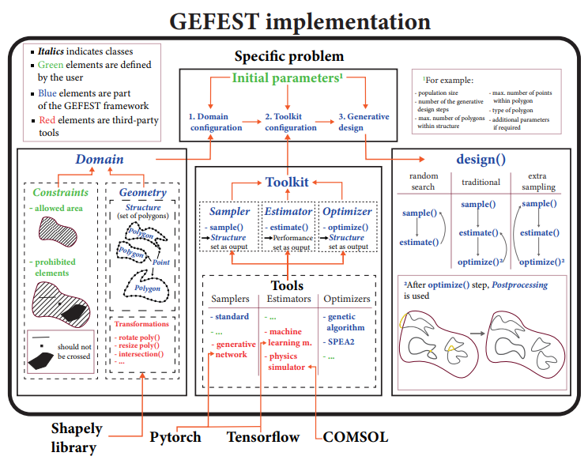

# GEFEST

**GEFEST** (**G**enerativ **E**volution **F**or **E**ncoded **ST**ructures) is a toolbox for the generative design of
physical objects.

It uses: (1) numerical modelling to simulate the interaction between object and environment;
(2) evolutionary optimization to produce new variants of geometrically-encoded structures.

The basic abstractions in GEFEST are Point, Polygon, Structure and Domain.

...

The workflow of the generative design is the following:

...

## Acknowledgments

We acknowledge the contributors for their important impact and the participants of the numerous scientific conferences
and workshops for their valuable advice and suggestions. The project is funded by ITMO University Students R&D project
№621289.

## Contacts

[Natural System Simulation Team](https://itmo-nss-team.github.io/)

[Newsfeed](https://t.me/NSS_group)

[Youtube channel](https://www.youtube.com/channel/UC4K9QWaEUpT_p3R4FeDp5jA)

## Citation

@inproceedings{nikitin2021generative, title={Generative design of microfluidic channel geometry using evolutionary
approach}, author={Nikitin, Nikolay O and Hvatov, Alexander and Polonskaia, Iana S and Kalyuzhnaya, Anna V and Grigorev,
Georgii V and Wang, Xiaohao and Qian, Xiang}, booktitle={Proceedings of the Genetic and Evolutionary Computation
Conference Companion}, pages={59--60}, year={2021} }

@article{nikitin2020multi, title={The multi-objective optimisation of breakwaters using evolutionary approach},
author={Nikitin, Nikolay O and Polonskaia, Iana S and Kalyuzhnaya, Anna V and Boukhanovsky, Alexander V}, journal={arXiv
preprint arXiv:2004.03010}, year={2020} }

