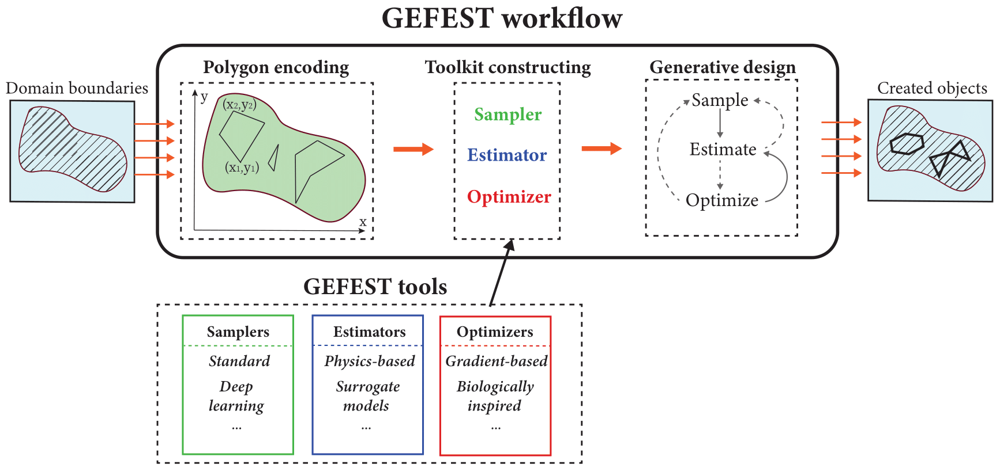

Intro to GEFEST
===============

| The GEFEST framework is a modular tool for the generative design of two-dimensional physical objects. 
| The essential points of the framework architecture are shown in figure below.
| First of all, the GEFEST receives the boundaries of considered two-dimensional domain as input.
| Optimization will be carried out in this domain. Then workflow including polygon encoding,
| toolkit constructing and generative design is performed. 
| At the output, the GEFEST generates samples from the joint probability distribution ``P(X, Y)``.

Polygon encoding
~~~~~~~~~~~~~~~~

| The first stage of the GEFEST workflow is polygon encoding.
| This procedure allows to represent real physical objects as two-dimensional polygons.

Toolkit constructing
~~~~~~~~~~~~~~~~~~~~

| After the specification of the design space, it is necessary to set a certain approach for each stage of the generative design procedure.
| To accomplish this purpose, we have implemented GEFEST tools (Samplers, Estimators, Optimizers) including various computational methods.

Generative design
~~~~~~~~~~~~~~~~~

| The fundamental stage of the GEFEST workflow is the generative design, depicted as last step in picture a head.
| This procedure is based on three principles: **sampling**, **estimation**, **optimization**, which can be combined in different ways.

| There are several examples of generative design process can be provided:

| The first one is solving breakwaters task:

.. image:: ../../img/breakwaters.*

| The second is cell trap example task:

.. image:: ../../img/selez.*

| The third is heat source example task:

.. image:: ../../img/heat.*